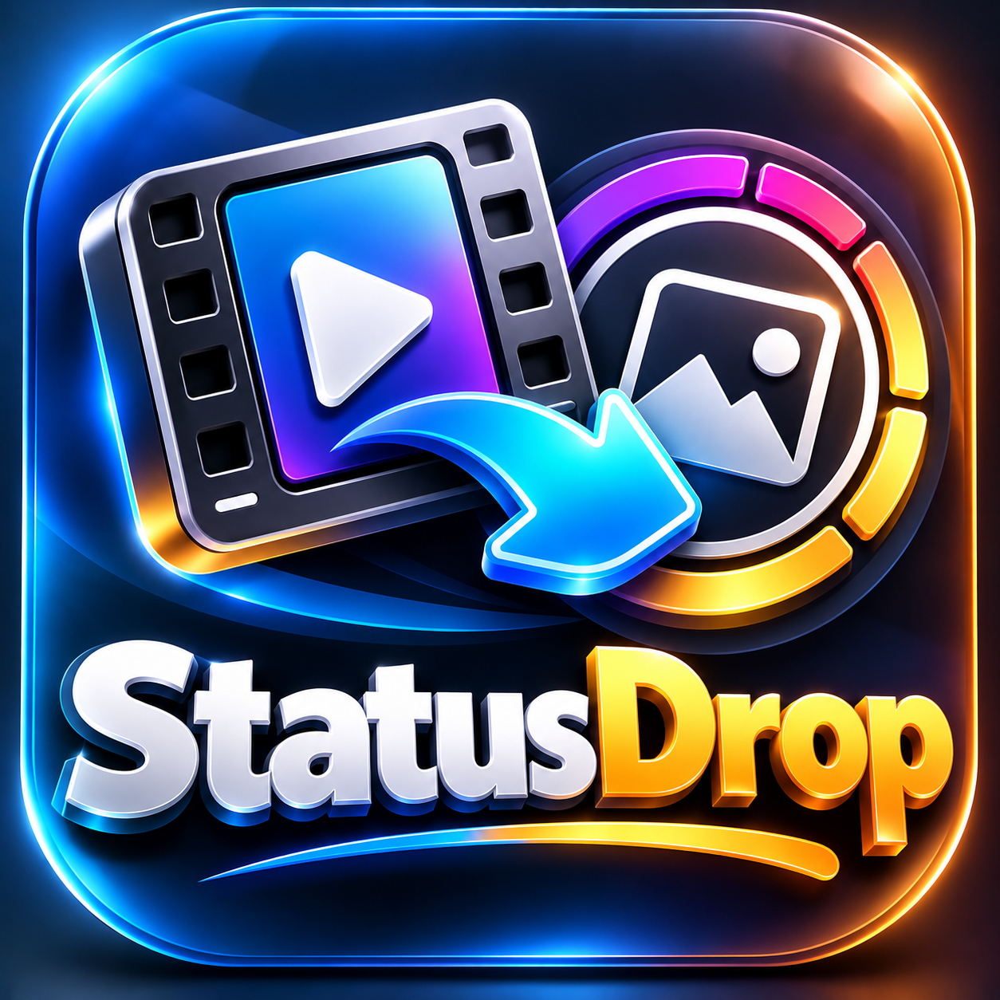

# StatusDrop

### Share a link → post it to your Status. Free, no ads, no tracking.

## How it works

1. Open any **public** video/reel/short (Facebook, Instagram, TikTok, X, and 1000+ sites).
2. Tap **Share → StatusDrop**. The video downloads on your phone.
3. Tap **Share to Status** (in the app or in the notification) → pick **My status**.

Everything runs on your phone. No server, no account, no ads.

> Status videos longer than 90 seconds are trimmed by WhatsApp itself.
> Private or login-only videos are not supported.

## Download

Grab the latest APK from [Releases](https://github.com/jawadtrader22/StatusDrop/releases/latest).
Pick `arm64-v8a` for most modern phones, or `universal` if unsure.

## Developer

**Jawad · Crystal AI Systems** · Telegram: [t.me/Jawadtrader22](https://t.me/Jawadtrader22)

## Credits

StatusDrop is a fork of [Seal](https://github.com/JunkFood02/Seal) by JunkFood02,
powered by [yt-dlp](https://github.com/yt-dlp/yt-dlp) via
[youtubedl-android](https://github.com/yausername/youtubedl-android).
All the heavy lifting is theirs; consider [sponsoring Seal's author](https://github.com/sponsors/JunkFood02).

StatusDrop is not affiliated with WhatsApp, Meta, or any video platform.
Only download content you have the right to share.

## License

[GPL-3.0](LICENSE), same as Seal.
